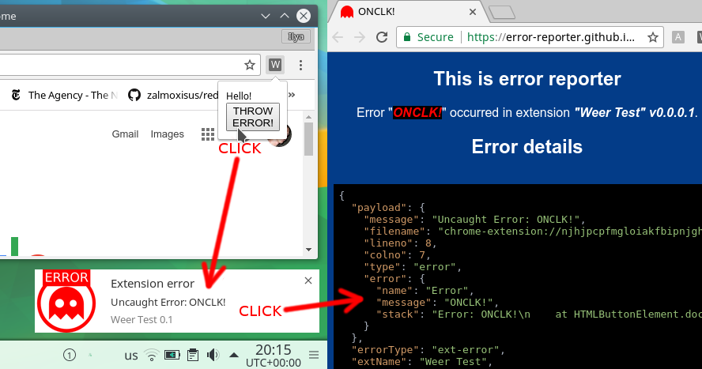

# Weer



[](https://travis-ci.org/error-reporter/weer)

> Web Extensions Error Reporter catches global errors, shows notifications and opens error reporter in one click

[Report page demo](https://error-reporter.github.io/v0/error/view/?title=Err%20in%20BG&json=%7B"payload"%3A%7B"message"%3A"Uncaught%20Error%3A%20Err%20in%20BG"%2C"filename"%3A"chrome-extension%3A%2F%2Fnjhjpcpfmgloiakfbipnjghcanjllmec%2Findex.js"%2C"lineno"%3A10%2C"colno"%3A3%2C"type"%3A"error"%2C"error"%3A%7B"name"%3A"Error"%2C"message"%3A"Err%20in%20BG"%2C"stack"%3A"Error%3A%20Err%20in%20BG%5Cn%20%20%20%20at%20foo%20%28chrome-extension%3A%2F%2Fnjhjpcpfmgloiakfbipnjghcanjllmec%2Findex.js%3A10%3A9%29%5Cn%20%20%20%20at%20chrome-extension%3A%2F%2Fnjhjpcpfmgloiakfbipnjghcanjllmec%2Findex.js%3A14%3A1"%7D%7D%2C"errorType"%3A"ext-error"%2C"extName"%3A"Weer%20Test"%2C"version"%3A"0.0.0.1"%2C"userAgent"%3A"Mozilla%2F5.0%20%28X11%3B%20Linux%20x86_64%29%20AppleWebKit%2F537.36%20%28KHTML%2C%20like%20Gecko%29%20Chrome%2F60.0.3112.90%20Safari%2F537.36"%2C"platform"%3A"Linux%20x86_64"%7D#toEmail=DONT_REPORT_PLEASE)

## Table of Contents

- [Why](#why)
  - [Catching Errors Without Weer](#catching-errors-without-weer)
  - [Weer in a Background Script](#weer-in-a-background-script)
  - [Weer in a Non-Background Script](#weer-in-a-non-background-script)
- [Install](#install)
- [Usage](#usage)
  - [Formats](#formats)
  - [Import](#import)
    - [With Bundler](#with-bundler)
    - [Without Bundler](#without-bundler)
  - [Debugging](#debugging)
  - [Examples of Setups](#examples-of-setups)
  - [Demo](#demo)
- [Supported Browsers](#supported-browsers)
- [API](#api)
- [Maintainer](#maintainer)
- [Contribute](#contribute)
- [Credits](#credits)
- [License](#license)

# Why

## Catching Errors Without Weer

There is some mess in how you catch errors in a web-extension:

```js
'use strict'; // Only if you don't use ES6 modules.
/*
  bg-window — background window, main window of a web-extension.
  non-bg-windows — popup, settings and other pages windows of a web-extension, that are not bg-window.
*/

window.addEventListener('error', (errorEvent) => {/* ... */});

// Case 1
throw new Error('Root (caught only in bg-window, not caught in non-bg windows');

// Case 2
setTimeout(
  () => { throw new Error('Timeouted root (caught by handlers'); },
  0,
);

// Case 3
chrome.tabs.getCurrent(() => {

  throw new Error('Chrome API callback (not caught by handlers)');

});

// Case 4
chrome.tabs.getCurrent(() => setTimeout(() => {

  throw new Error('Timeouted Chrome API callback (caught by handlers)');

}, 0));
```
So if you want error catchers to work — your code must be wrapped in `setTimeout`.

This behavior may be a bug and is discussed in https://crbug.com/357568.

Now let's look how to catch errors with Weer.

## Weer in a Background Script

```js
'use strict'; // Only if you don't use ES6 modules.
// Import and setup Weer here, see corresponding paragraphs below.

throw new Error('This is caught by Weer, notification is shown, opens error reporter on click');
```

## Weer in a Non-Background Script

```js
// In popup, settings and other pages.
'use strict'; // Only if you don't use ES6 modules.

chrome.runtime.getBackgroundPage((bgWindow) =>
  bgWindow.Weer.ErrorCatchers.installListenersOn({ hostWindow: window, nameForDebug: 'PUP' }, () => {

    // Put all your code inside this arrow body (it is timeouted).

    // Case 1:
    throw new Error('PUPERR (caught by Weer)');

    // Case 2:
    document.getElementById('btn').onclick = () => {

      throw new Error('ONCLCK! (caught by Weer)');

    };

    // Case 3:
    chrome.tabs.getCurrent(Weer.Utils.timeouted(() => {

      throw new Error('Timeouted Chrome API callback (caught by Weer)');

    }));

  })
);

// Case 4:
chrome.tabs.getCurrent(Weer.Utils.timeouted(() => {

  throw new Error('Timeouted Chrome API callback (caught by Weer)');

}));

```

## Install

`npm install --save weer`

## Usage

### Formats

```console
tree ./node_modules/weer
weer/
├── cjs // Common JS format: `require(...)`
│   ├── error-catchers.js
│   ├── get-notifiers-singleton.js
│   ├── index.js
│   └── utils.js
├── esm // EcmaScript Modules format: `import ...`
│   ├── error-catchers.js
│   ├── get-notifiers-singleton.js
│   ├── index.js
│   └── utils.js
├── package.json
└── umd // Universal Module Definition format: `<script src=...></script>`
    ├── error-catchers.js // Requires `utils` bundle
    ├── get-notifiers-singleton.js // Requires `utils` bundle
    ├── index.js // All in one bundle, no dependencies
    └── utils.js
```
### Import

#### With Bundler

For webpack, rollup, etc.

```js
import Weer from 'weer';
```

If you need only a part of the API:

```js
import Utils from 'weer/esm/utils';
import ErrorCatchers from 'weer/esm/error-catchers';
import GetNotifiersSingleton from 'weer/esm/get-notifiers-singleton';
```

#### Without Bundler

```console
$ cp ./node_modules/weer/umd/index.js ./foo-extension/vendor/weer.js
$ cat foo-extension/manifest.json
...
"scripts": [
  "./vendor/optional-debug.js",
  "./vendor/weer.js",
  ...
],
...
```

### Setup

```js
// Import Weer somehow.
window.Weer = Weer; // Expose for non-bg windows (popup, settings, etc.).

Weer.install({
  // Required:
  sendReports: {
    toEmail: 'homerjsimpson@example.com',
    inLanguages: ['en'],
  },
  // Optional:
  extErrorIconUrl: 'https://example.com/img/ext-error-128.png',
  pacErrorIconUrl: 'https://example.com/img/pac-error-128.png',
  maskIconUrl: 'https://example.com/img/mask-128.png',
});
```

### Debugging

1. Bundle [visionmedia/debug] for your environment and export global `debug`.
2. Enable it by `debug.enable('weer:*')` in extension background window and reload extension.

[visionmedia/debug]: https://github.com/visionmedia/debug


### Examples of Setups

See [examples](./examples) of setups for webpack, rollup or without bundlers.

### Demo

```
clone this repo
npm install
cd examples
npm start
ls dist <- Load as unpacked extension and play (tested on Chrome).
```

## Supported Browsers

Chrome: yes  
Firefox: yes, but notifications are not sticky, unhandled proimise rejections are [never] caught.

[never]: https://developer.mozilla.org/en-US/docs/Web/Events/unhandledrejection#Browser_compatibility


## API

See [API.md](./API.md).

## Maintainer

- [Ilya Ig. Petrov](https://gitbub.com/ilyaigpetrov)

## Contribute

You are welcome to propose [issues](https://github.com/error-reporter/weer/issues), pull requests or ask questions.

## Credits

For credits of used assets see https://github.com/error-reporter/error-reporter.github.io

## License

[GPL-3.0+](./LICENSE)
